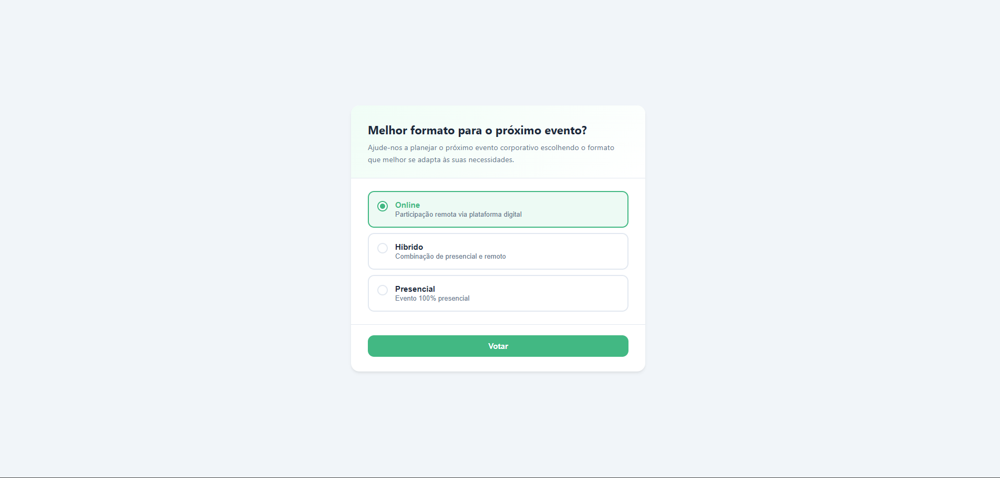

# Módulo de Votação Interativa

Aplicação Vue 3 para votação em tempo real com simulação de API local, persistência via localStorage e exibição de resultados com barras de progresso animadas.



## Como rodar

### Instalação

```bash
npm install
```

### Execução

```bash
npm run dev
```

Acesse `http://localhost:5173` no navegador.

---

## Decisões técnicas

### Pinia
O Pinia foi escolhido como solução de estado por ser o gerenciador oficial recomendado para Vue 3. Ele oferece a Composition API nativamente, tipagem previsível e devtools integrado. A store centraliza os dados da enquete, os resultados e o estado de loading/submitting, expondo getters computados (`totalVotes`, `resultsWithPercentage`) que evitam lógica duplicada nos componentes.

### Componentização
A interface foi dividida em quatro componentes reutilizáveis:

| Componente | Responsabilidade |
|---|---|
| `PollCard` | Container visual com header/body/footer via slots |
| `VoteOption` | Botão de seleção de opção com estado visual e acessibilidade |
| `ResultItem` | Item de resultado com label, votos e barra de progresso |
| `ProgressBar` | Barra de progresso animada com suporte a estado "vencedor" |

As views (`VotingView`, `ResultsView`) orquestram os componentes e gerenciam os fluxos de navegação.

### Simulação de API
O `pollService.js` simula chamadas assíncronas com `Promise` + `setTimeout`, replicando a latência de uma API real. Isso força o tratamento correto de estados de loading e evita código síncrono que mascararia problemas reais ao integrar um backend.

### localStorage
O voto do usuário e os contadores de votos são persistidos no localStorage, garantindo que:
- O usuário não perca o voto ao recarregar a página
- Os resultados acumulem entre sessões (comportamento próximo de um backend real)
- O fluxo "votar novamente" limpe o estado corretamente

---

## Melhorias futuras

- **Backend real** — substituir o `pollService` por chamadas REST
- **WebSocket** — atualização em tempo real dos resultados sem necessidade de reload
- **Múltiplas enquetes** — suporte a lista de enquetes com roteamento dinâmico
- **Dashboard administrativo** — criação e gerenciamento de enquetes
- **Autenticação** — controle de um voto por usuário autenticado
- **Expiração de enquetes** — data de início/fim com estado `encerrada`
- **Testes unitários** — cobertura da store, serviços e componentes com Vitest

---

## Uso de IA

A inteligência artificial (Claude) foi utilizada como apoio para:

- **Estruturação inicial** — definição da arquitetura de pastas e divisão de responsabilidades
- **Revisão de arquitetura** — validação das escolhas de componentização e separação de camadas
- **Sugestões de componentização** — identificação dos limites corretos entre componentes

Toda a validação, adaptação e tomada de decisão da solução foi realizada pelo dev, garantindo consistência aos requisitos e qualidade do código entregue.

---

## Estrutura do projeto

```
src/
├── App.vue
├── main.js
├── router/
│   └── index.js
├── stores/
│   └── pollStore.js
├── services/
│   └── pollService.js
├── components/
│   ├── PollCard.vue
│   ├── VoteOption.vue
│   ├── ResultItem.vue
│   └── ProgressBar.vue
├── views/
│   ├── VotingView.vue
│   └── ResultsView.vue
└── assets/
    └── styles/
        ├── global.css
        ├── components/
        │   ├── LoadingSpinner.css
        │   ├── PollCard.css
        │   ├── ProgressBar.css
        │   ├── ResultItem.css
        │   ├── Toast.css
        │   └── VoteOption.css
        └── pages/
            ├── ResultsPage.css
            └── VotingPage.css
```
